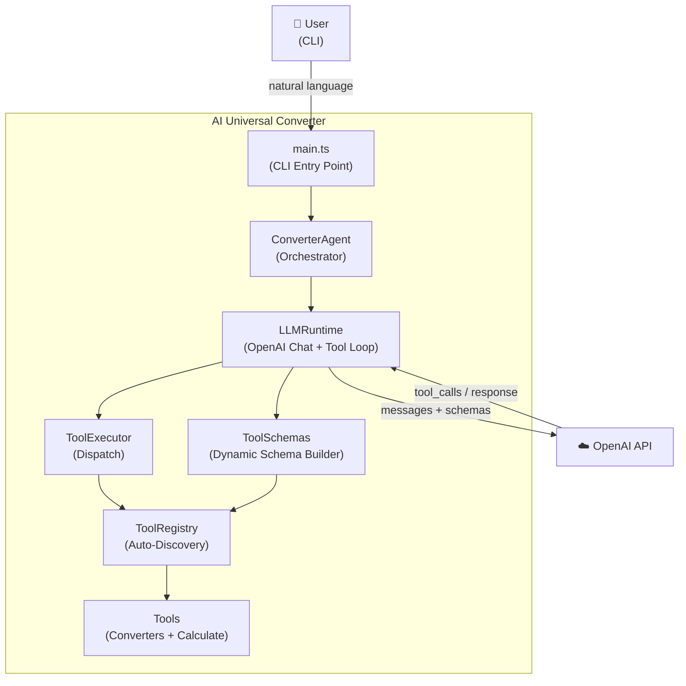
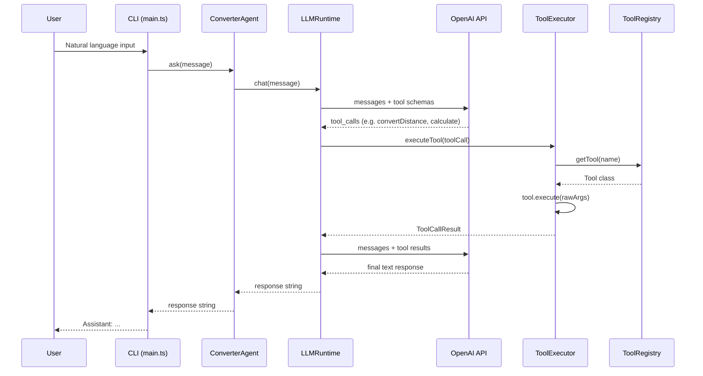
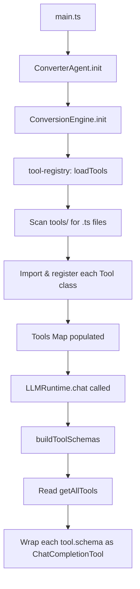
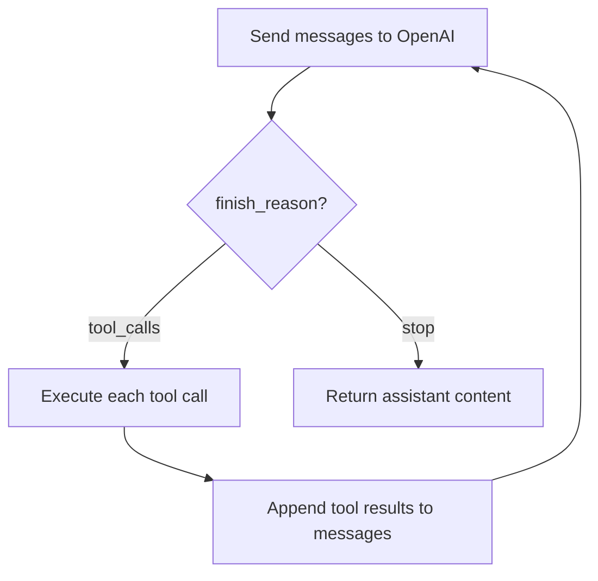
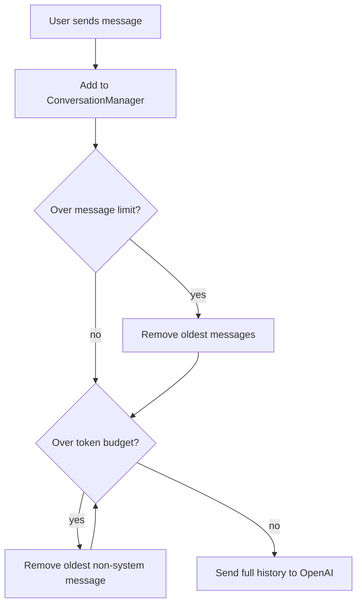

# AI Universal Converter

## Overview

AI Universal Converter is an educational and experimental software project designed to explore modern Large Language Model (LLM) capabilities through a single, coherent domain: **conversions and calculations**.

The project evolves incrementally, allowing experimentation with:

- Tool Calling
- Structured Outputs
- Function Schemas
- Multiple Tool Calls
- Tool Chaining
- Conversational Memory
- Reasoning Workflows
- Agentic Behaviors

## Primary Goals

- Learn and demonstrate modern OpenAI capabilities
- Build a maintainable and extensible architecture
- Implement increasingly sophisticated reasoning patterns
- Maintain a consistent problem domain throughout the project's lifecycle

## Secondary Goals

- Explore agentic workflows
- Experiment with multi-step planning
- Implement persistent conversational context
- Create reusable abstractions for tool execution

## Project Structure

```
src/
├── agent/
│   ├── converter-agent.ts
│   └── prompts.ts
├── runtime/
│   ├── llm-runtime.ts
│   ├── tool-executor.ts
│   └── conversation-manager.ts
├── tools/
│   ├── base/
│   │   ├── tool.ts
│   │   ├── base-converter.ts
│   │   └── ratio-converter.ts
│   ├── calculate.ts
│   ├── convert-*.ts
│   └── tool-registry.ts
├── schemas/
│   └── tool-schemas.ts
├── tests/
├── logger.ts
├── app.ts
└── main.ts
```

## Architecture

### Tool Hierarchy

```
Tool (abstract)                → schema + execute contract
├── BaseConverter              → shared validation + schema generation from units/toolDescription
│   ├── RatioConverter         → ratio-based convert logic (FACTORS + convert)
│   │   ├── ConvertDistance
│   │   ├── ConvertWeight
│   │   ├── ConvertStorage
│   │   ├── ConvertArea
│   │   ├── ConvertVolume
│   │   ├── ConvertSpeed
│   │   ├── ConvertEnergy
│   │   └── ConvertTime
│   └── ConvertTemperature     → formula-based (owns its own convert)
└── Calculate                  → general-purpose math expression evaluator
```

### C4 Level 2 — Container Diagram



### Application Flow

The following diagram shows the complete request lifecycle from user input to final response:



### Initialization Flow

At startup, the system auto-discovers all tools and builds schemas dynamically:



### Tool Call Loop

The LLM runtime supports chained tool calls — the model can invoke multiple tools sequentially before producing a final answer:



### Conversational Context

The `ConversationManager` maintains message history across multiple `chat()` calls, enabling context-aware follow-up responses. It implements a dual pruning strategy:

1. **Message-count pruning** — caps history at a configurable maximum (default 50 messages)
2. **Token-budget pruning** — uses `tiktoken` to count tokens with the model's actual encoding and removes oldest non-system messages until the history fits within budget (default 8,000 tokens)

The system prompt is always preserved during pruning.



### Auto-Discovery

The `tool-registry.ts` module automatically discovers all `.ts` files in the `tools/` directory at runtime. Any exported class with a static `schema` and `execute` method (the `Tool` contract) is registered automatically. Adding a new tool requires zero manual registration — just create the file.

```typescript
import { ConversionEngine } from './app.ts'

await ConversionEngine.init()

ConversionEngine.convert('distance', 50, 'km', 'mi')
ConversionEngine.getAvailableTypes() // ['distance', 'weight', 'storage', 'temperature', ...]
```

### Adding a New Converter

Create a file `src/tools/convert-speed.ts`:

```typescript
import { RatioConverter } from './base/ratio-converter.ts'

export class ConvertSpeed extends RatioConverter {
  static readonly toolDescription = 'Convert between speed units.'
  protected static readonly FACTORS = {
    'km/h': 1,
    'mph': 1.60934,
    'm/s': 3.6,
  }
}
```

No additional registration needed.

### Adding a New Standalone Tool

Create a file `src/tools/my-tool.ts`:

```typescript
import type { FunctionDefinition } from 'openai/resources/shared'
import { Tool } from './base/tool.ts'

export class MyTool extends Tool {
  static readonly schema: FunctionDefinition = {
    name: 'myTool',
    description: 'Does something useful.',
    parameters: {
      type: 'object',
      properties: {
        input: { type: 'string', description: 'The input.' },
      },
      required: ['input'],
    },
  }

  static execute(rawArgs: string): number | string {
    const { input } = JSON.parse(rawArgs)
    // ... tool logic
    return result
  }
}
```

No additional registration needed.

## Technology Stack

- **Language**: TypeScript
- **Runtime**: Node.js
- **LLM**: OpenAI SDK
- **Token Management**: tiktoken
- **Validation**: Zod
- **Testing**: Vitest

## Usage Examples

### Basic Conversion
```
Convert 50 kilometers to miles.
```

### Multi-Step Conversion
```
Convert 100 USD to COP and divide the result by 25,000.
```

### Conversational Context
```
You: Convert 100 kilometers to miles.
Assistant: 100 kilometers equals 62.14 miles.

You: Now double that.
Assistant: 62.14 × 2 = 124.27 miles.
```

Type `reset` in the CLI to clear the session and start fresh.

### Complex Reasoning (Agentic)
```
I will travel 350 km. My car consumes 8 liters per 100 km and fuel costs 15,000 COP per gallon. Estimate my trip expenses.
```

The LLM breaks this into steps, using `calculate` for arithmetic and `convertVolume` for unit conversion, then combines the results into a final answer.

## Installation

```bash
# Clone the repository
git clone <repository-url>
cd ai-universal-converter

# Install dependencies
npm install

# Run tests
npm test

# Start the application
npm start
```

## Development

### Running Tests
```bash
npm test
```

### Running in Development Mode
```bash
npm run dev
```

### Building for Production
```bash
npm run build
```

## License

This project is licensed under the MIT License.

## Success Criteria

The project will be considered successful when it demonstrates:

- Reliable Tool Calling
- Modular tool execution
- Multi-step reasoning
- Context-aware conversations
- Agentic workflows within the conversion domain
- Structured Outputs with schema-validated LLM responses
- An extensible architecture suitable for future experimentation
