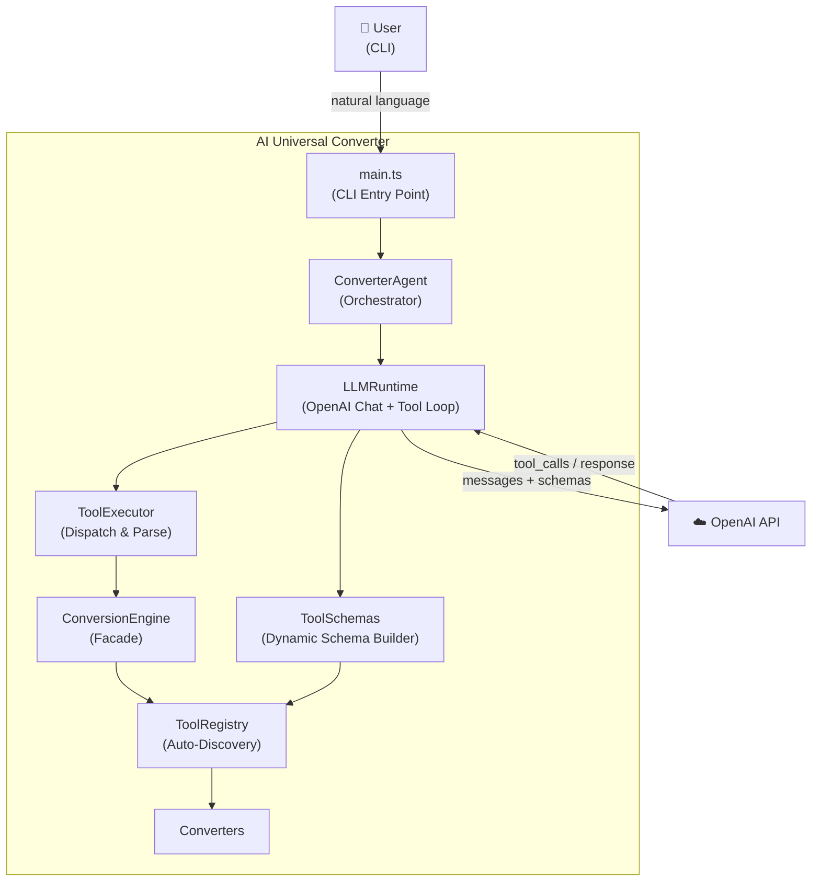
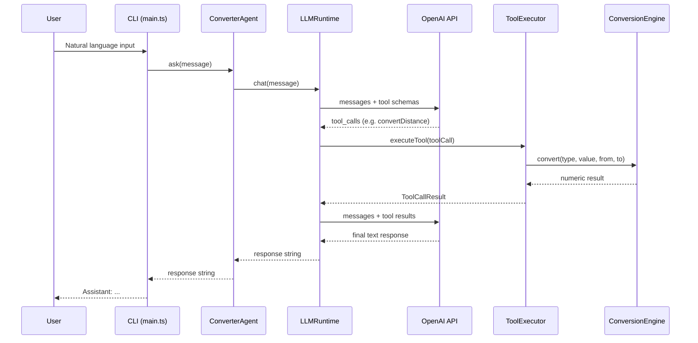
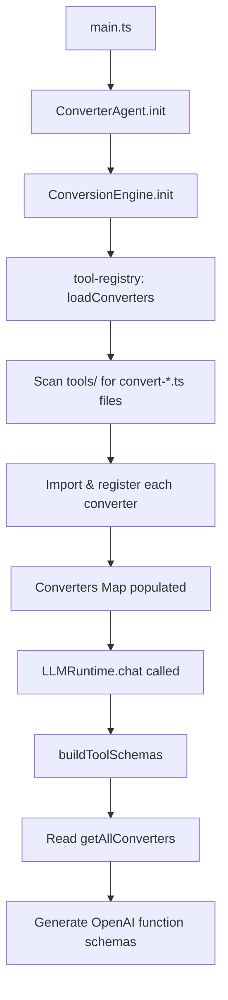
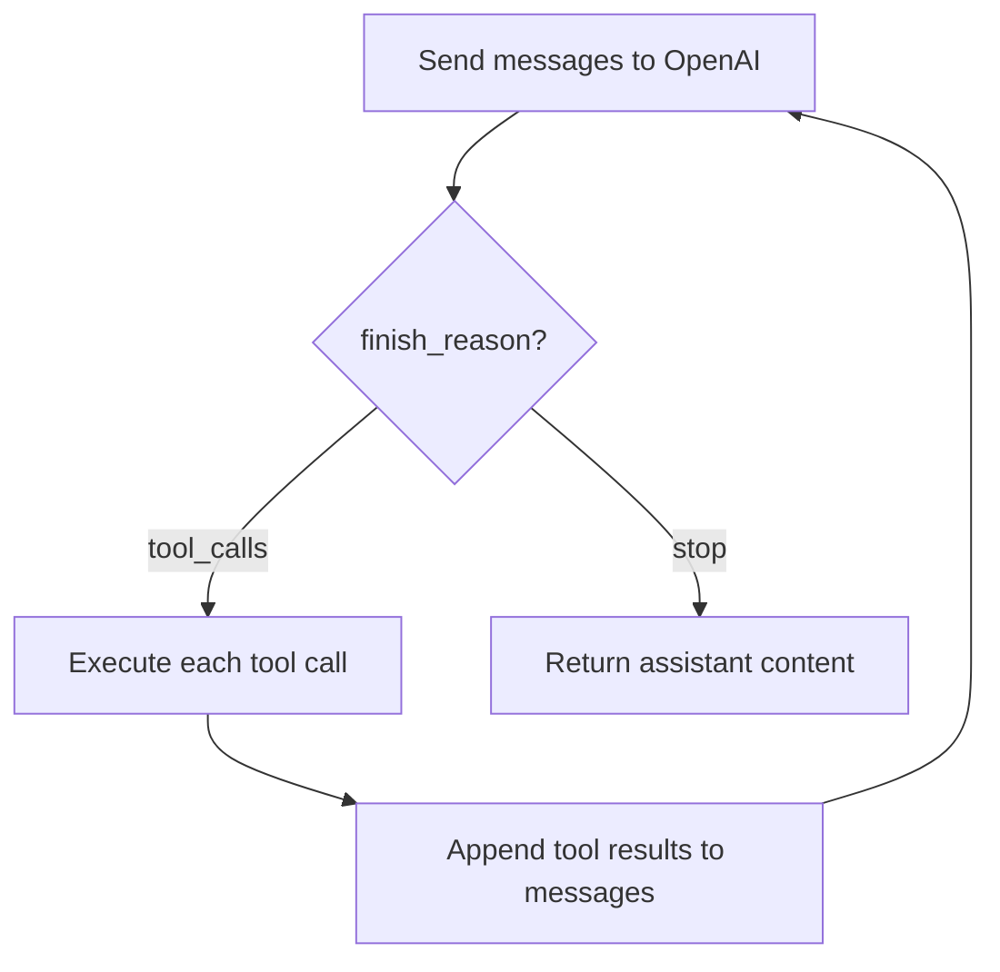

# AI Universal Converter

## Overview

AI Universal Converter is an educational and experimental software project designed to explore modern Large Language Model (LLM) capabilities through a single, coherent domain: **conversions and calculations**.

The project evolves incrementally, allowing experimentation with:

- Tool Calling
- Structured Outputs
- Function Schemas
- Multiple Tool Calls
- Tool Chaining
- Conversational Memory
- Reasoning Workflows
- Agentic Behaviors

## Primary Goals

- Learn and demonstrate modern OpenAI capabilities
- Build a maintainable and extensible architecture
- Implement increasingly sophisticated reasoning patterns
- Maintain a consistent problem domain throughout the project's lifecycle

## Secondary Goals

- Explore agentic workflows
- Experiment with multi-step planning
- Implement persistent conversational context
- Create reusable abstractions for tool execution

## Project Structure

```
src/
├── agent/
│   └── converter-agent.ts
├── runtime/
│   ├── llm-runtime.ts
│   ├── tool-executor.ts
│   └── conversation-manager.ts
├── tools/
│   ├── base/
│   │   ├── base-converter.ts
│   │   └── ratio-converter.ts
│   ├── convert-*.ts
│   └── tool-registry.ts
├── schemas/
│   └── tool-schemas.ts
├── models/
│   ├── conversation.ts
│   └── tool-execution.ts
├── database/
│   └── sqlite.ts
├── tests/
└── app.ts
```

## Architecture

### Converter Hierarchy

```
BaseConverter              → shared validation (validateUnit, validateValue)
├── RatioConverter         → ratio-based convert logic (FACTORS + convert)
│   ├── ConvertDistance
│   ├── ConvertWeight
│   └── ConvertStorage
└── ConvertTemperature     → formula-based (owns its own convert)
```

### C4 Level 2 — Container Diagram



### Application Flow

The following diagram shows the complete request lifecycle from user input to final response:



### Initialization Flow

At startup, the system auto-discovers converters and builds tool schemas dynamically:



### Tool Call Loop

The LLM runtime supports chained tool calls — the model can invoke multiple tools sequentially before producing a final answer:



### Auto-Discovery

The `tool-registry.ts` module automatically discovers all `convert-*.ts` files in the `tools/` directory at runtime. Adding a new converter requires zero manual registration — just create the file.

```typescript
import { ConversionEngine } from './app.ts'

await ConversionEngine.init()

ConversionEngine.convert('distance', 50, 'km', 'mi')
ConversionEngine.getAvailableTypes() // ['distance', 'weight', 'storage', 'temperature']
```

### Adding a New Converter

Create a file `src/tools/convert-speed.ts`:

```typescript
import { RatioConverter } from './base/ratio-converter.ts'

export class ConvertSpeed extends RatioConverter {
  protected static readonly FACTORS = {
    'km/h': 1,
    'mph': 1.60934,
    'm/s': 3.6,
  }
}
```

No additional registration needed.

## Technology Stack

- **Language**: TypeScript
- **Runtime**: Node.js
- **LLM**: OpenAI SDK
- **Validation**: Zod
- **Database**: SQLite
- **Testing**: Vitest

## Usage Examples

### Basic Conversion
```
Convert 50 kilometers to miles.
```

### Multi-Step Conversion
```
Convert 100 USD to COP and divide the result by 25,000.
```

### Conversational Context
```
Convert 100 USD to COP.
Now multiply that result by 5.
```

### Complex Reasoning
```
I will travel 350 km. My car consumes 8 liters per 100 km and fuel costs 15,000 COP per gallon. Estimate my trip expenses.
```

## Installation

```bash
# Clone the repository
git clone <repository-url>
cd ai-universal-converter

# Install dependencies
npm install

# Run tests
npm test

# Start the application
npm start
```

## Development

### Running Tests
```bash
npm test
```

### Running in Development Mode
```bash
npm run dev
```

### Building for Production
```bash
npm run build
```

## License

This project is licensed under the MIT License.

## Success Criteria

The project will be considered successful when it demonstrates:

- Reliable Tool Calling
- Modular tool execution
- Multi-step reasoning
- Context-aware conversations
- Agentic workflows within the conversion domain
- An extensible architecture suitable for future experimentation
