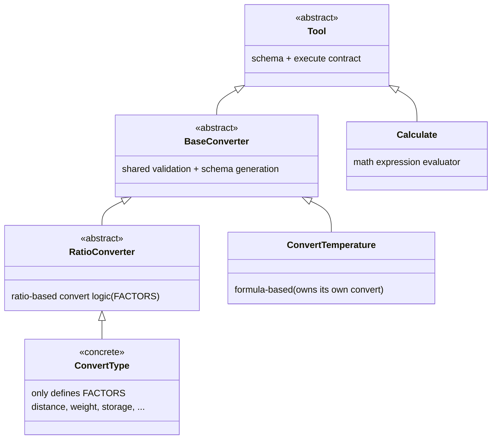
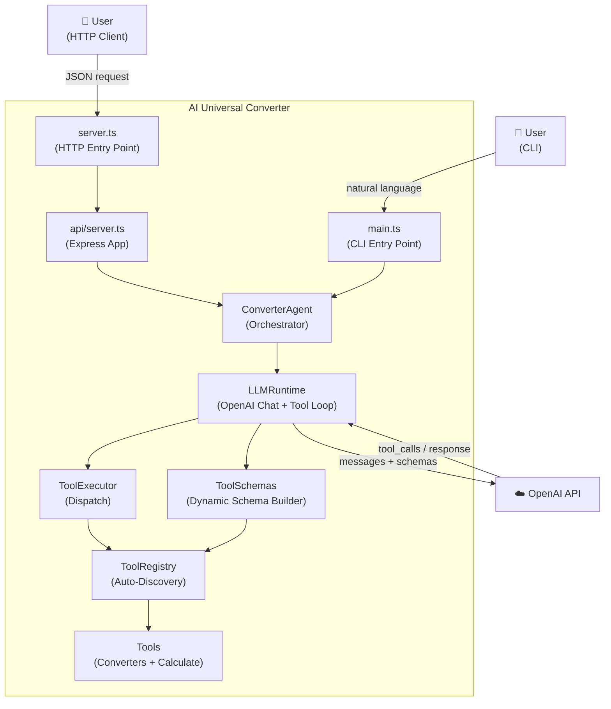
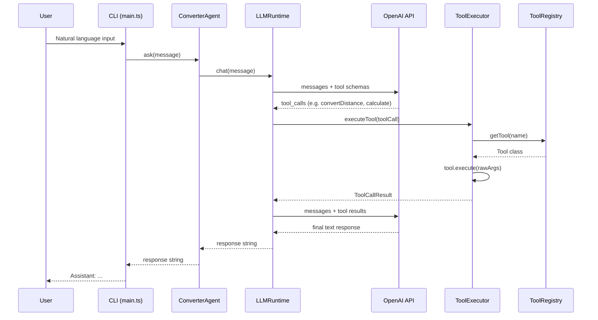
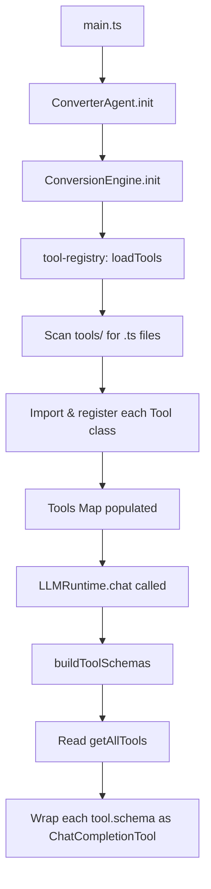
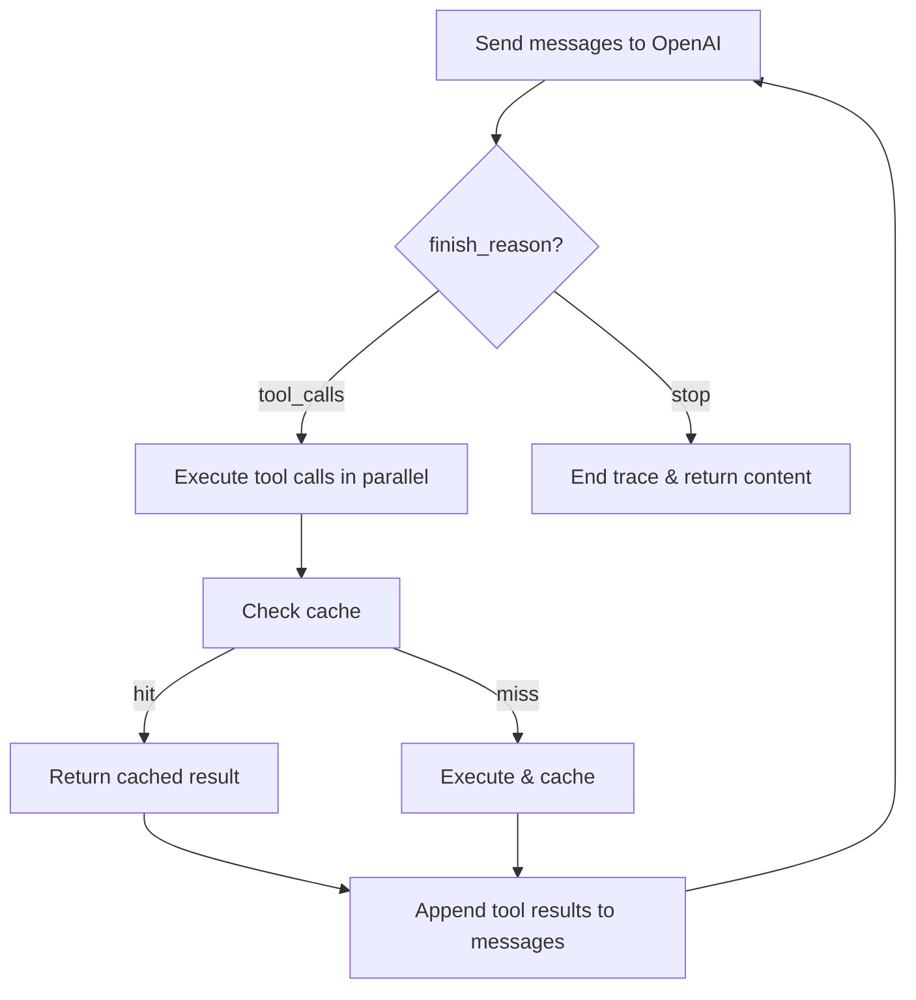
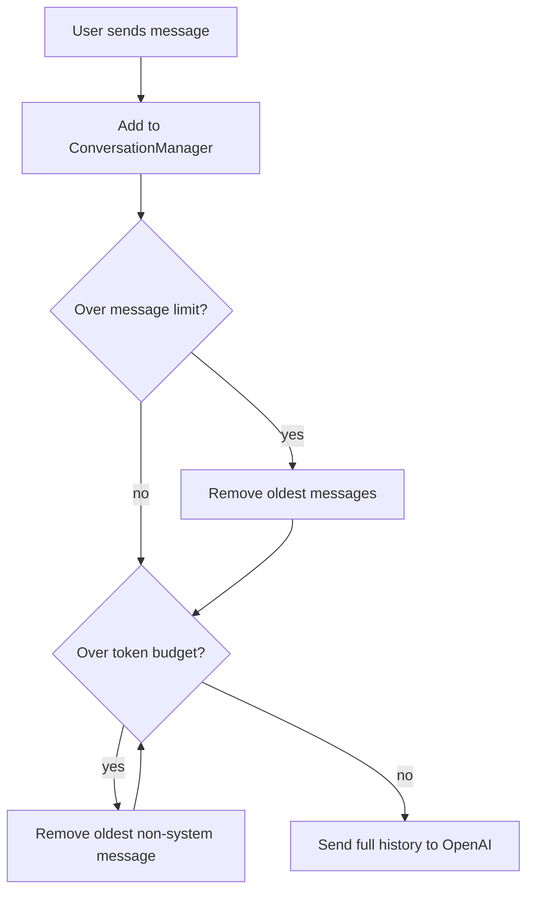

# AI Universal Converter

## Overview

AI Universal Converter is an educational and experimental software project designed to explore modern Large Language Model (LLM) capabilities through a single, coherent domain: **conversions and calculations**.

The project evolves incrementally, allowing experimentation with:

- Tool Calling
- Structured Outputs
- Function Schemas
- Multiple Tool Calls
- Tool Chaining
- Conversational Memory
- Reasoning Workflows
- Agentic Behaviors

## Primary Goals

- Learn and demonstrate modern OpenAI capabilities
- Build a maintainable and extensible architecture
- Implement increasingly sophisticated reasoning patterns
- Maintain a consistent problem domain throughout the project's lifecycle

## Secondary Goals

- Explore agentic workflows
- Experiment with multi-step planning
- Implement persistent conversational context
- Create reusable abstractions for tool execution

## Project Structure

```
src/
├── agent/
│   ├── converter-agent.ts
│   └── prompts.ts
├── api/
│   └── server.ts
├── runtime/
│   ├── llm-runtime.ts
│   ├── tool-executor.ts
│   ├── conversation-manager.ts
│   ├── observability.ts
│   └── tool-cache.ts
├── tools/
│   ├── base/
│   │   ├── tool.ts
│   │   ├── base-converter.ts
│   │   └── ratio-converter.ts
│   ├── calculate.ts
│   ├── convert-*.ts
│   └── tool-registry.ts
├── schemas/
│   └── tool-schemas.ts
├── tests/
├── logger.ts
├── app.ts
├── main.ts
└── server.ts
```

## Architecture

### Tool Hierarchy

```
Tool (abstract)                → schema + execute contract
├── BaseConverter              → shared validation + schema generation from units/toolDescription
│   ├── RatioConverter         → ratio-based convert logic (FACTORS + convert)
│   │   └── Convert{Type}     → concrete converters that only define FACTORS (distance, weight, storage, ...)
│   └── ConvertTemperature     → formula-based (owns its own convert method)
└── Calculate                  → general-purpose math expression evaluator
```



### C4 Level 2 — Container Diagram



### Application Flow

The following diagram shows the complete request lifecycle from user input to final response:



### Initialization Flow

At startup, the system auto-discovers all tools and builds schemas dynamically:



### Tool Call Loop

The LLM runtime supports chained tool calls — the model can invoke multiple tools in parallel before producing a final answer:



### Conversational Context

The `ConversationManager` maintains message history across multiple `chat()` calls, enabling context-aware follow-up responses. It implements a dual pruning strategy:

1. **Message-count pruning** — caps history at a configurable maximum (default 50 messages)
2. **Token-budget pruning** — uses `tiktoken` to count tokens with the model's actual encoding and removes oldest non-system messages until the history fits within budget (default 8,000 tokens)

The system prompt is always preserved during pruning.



### Auto-Discovery

The `tool-registry.ts` module automatically discovers all `.ts` files in the `tools/` directory at runtime. Any exported class with a static `schema` and `execute` method (the `Tool` contract) is registered automatically. Adding a new tool requires zero manual registration — just create the file.

```typescript
import { ConversionEngine } from './app.ts'

await ConversionEngine.init()

ConversionEngine.convert('distance', 50, 'km', 'mi')
ConversionEngine.getAvailableTypes() // ['distance', 'weight', 'storage', 'temperature', ...]
```

### Adding a New Converter

Create a file `src/tools/convert-speed.ts`:

```typescript
import { RatioConverter } from './base/ratio-converter.ts'

export class ConvertSpeed extends RatioConverter {
  static readonly toolDescription = 'Convert between speed units.'
  protected static readonly FACTORS = {
    'km/h': 1,
    'mph': 1.60934,
    'm/s': 3.6,
  }
}
```

No additional registration needed.

### Adding a New Standalone Tool

Create a file `src/tools/my-tool.ts`:

```typescript
import type { FunctionDefinition } from 'openai/resources/shared'
import { Tool } from './base/tool.ts'

export class MyTool extends Tool {
  static readonly schema: FunctionDefinition = {
    name: 'myTool',
    description: 'Does something useful.',
    parameters: {
      type: 'object',
      properties: {
        input: { type: 'string', description: 'The input.' },
      },
      required: ['input'],
    },
  }

  static execute(rawArgs: string): number | string {
    const { input } = JSON.parse(rawArgs)
    // ... tool logic
    return result
  }
}
```

No additional registration needed.

### Runtime Observability

The `ObservabilityManager` provides full visibility into the request lifecycle:

- **Execution traces** — per-request trace with unique ID and step-by-step breakdown
- **Latency tracking** — duration for each LLM call, tool execution, and total request
- **Token usage** — prompt/completion/total tokens accumulated across all LLM round-trips
- **Tool statistics** — call count, average latency, cache hit ratio, and failure rate per tool
- **Reasoning visualization** — CLI tree view showing the full reasoning chain when `TRACE=true`

```
┌ Trace a1b2c3d4
├─ 🤖 OpenAI Chat (420ms)
├─ 🔧 convertVolume (2ms) → 7.40
├─ 🔧 calculate (1ms) [cached] → 111000
├─ 🤖 OpenAI Chat (380ms)
└ Total: 803ms | 275 tokens (180↑ 95↓) | 2 tool calls | 1 cache hits
```

Enable with: `TRACE=true npm run dev`

### Tool Selection Optimization

The `buildFilteredToolSchemas` function uses keyword matching to send only relevant tool schemas to OpenAI, reducing token usage and improving selection accuracy. Falls back to all schemas when no keywords match.

### Tool Result Caching

The `ToolCache` provides LRU caching for deterministic tool results. Same inputs always produce the same output for ratio converters and calculations, so results are cached to avoid redundant computation.

## Coding Standards

- **Classes over functions** — tools, runtime, and agent are class-based with static methods where appropriate
- **JSDoc on all public methods** — include `@param`, `@returns`, and `@throws` tags
- **Explicit access modifiers** — use `private` for internal class members
- **`readonly` for constants** — static configuration properties use `static readonly`
- **Type imports** — use `import type { ... }` for types that don't exist at runtime
- **File naming** — kebab-case for all files (e.g. `convert-distance.ts`, `tool-executor.ts`)
- **Class naming** — PascalCase (e.g. `ConvertDistance`, `LLMRuntime`)
- **One class per file** — each tool/module lives in its own file
- **No default exports** — use named exports exclusively
- **Tests** — colocated in `src/tests/` with `.test.ts` suffix; test both happy paths and error cases; use `toBeCloseTo` for floating-point assertions

## Technology Stack

- **Language**: TypeScript
- **Runtime**: Node.js
- **HTTP Framework**: Express.js
- **LLM**: OpenAI SDK
- **Token Management**: tiktoken
- **Validation**: Zod
- **Testing**: Vitest

## Usage Examples

### CLI

#### Basic Conversion
```
Convert 50 kilometers to miles.
```

#### Multi-Step Conversion
```
Convert 100 USD to COP and divide the result by 25,000.
```

#### Conversational Context
```
You: Convert 100 kilometers to miles.
Assistant: 100 kilometers equals 62.14 miles.

You: Now double that.
Assistant: 62.14 × 2 = 124.27 miles.
```

Type `reset` in the CLI to clear the session and start fresh.

#### Complex Reasoning (Agentic)
```
I will travel 350 km. My car consumes 8 liters per 100 km and fuel costs 15,000 COP per gallon. Estimate my trip expenses.
```

The LLM breaks this into steps, using `calculate` for arithmetic and `convertVolume` for unit conversion, then combines the results into a final answer.

### REST API

#### Health Check
```bash
curl http://localhost:3000/api/health
# { "status": "ok" }
```

#### Chat (Natural Language Request)
```bash
curl -X POST http://localhost:3000/api/chat \
  -H "Content-Type: application/json" \
  -d '{"message": "Convert 100 km to miles"}'
# { "response": "100 kilometers equals 62.14 miles." }
```

#### Error Handling
```bash
curl -X POST http://localhost:3000/api/chat \
  -H "Content-Type: application/json" \
  -d '{}'
# 400 { "error": "A \"message\" string field is required." }
```

## Installation

```bash
# Clone the repository
git clone <repository-url>
cd ai-universal-converter

# Install dependencies
npm install

# Run tests
npm test

# Start the CLI
npm start

# Start the HTTP API server
npm run start:api
```

## Development

### Running Tests
```bash
npm test
```

### Running CLI in Development Mode
```bash
npm run dev
```

### Running API in Development Mode
```bash
npm run dev:api
# Server listens on http://localhost:3000 (override with PORT env var)
```

### Building for Production
```bash
npm run build
```

## License

This project is licensed under the MIT License.

## Success Criteria

The project will be considered successful when it demonstrates:

- Reliable Tool Calling
- Modular tool execution
- Multi-step reasoning
- Context-aware conversations
- Agentic workflows within the conversion domain
- Structured Outputs with schema-validated LLM responses
- Runtime observability with execution traces and metrics
- An extensible architecture suitable for future experimentation
